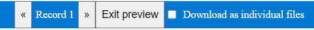

# Mail merge in Word processor
This demo illustrates how to create template Word document and generate reports like invoice using mail merge in Syncfusion Word processor (a.k.a.) Document editor within your Web application.

## Steps to run angular and web services app

To work on this demo, run the web services and angular app simultaneously.

### Run the web services
To Run the webservices in "Web Services/ASP.NET Core" folder, run the following commands
* **dotnet restore** to restore the nuget packages.
* **dotnet run** to run the web services.

### Run the angular app

To run the angular app,

* Install the package using **npm install** command.
* Then, set the **serviceURL** in Document editor by running web services URL.

 For example, if you running URL is "http://localhost:62869/", Change the URL in app.component.ts file line number: 140.
* Run the app, using **npm start** command. Now, the document editor will launch in browser.

## Demo illustration

### Insert Merge Field

You can insert the merge field in Documenteditor using the **Select Field to Insert** pane in left side or **Insert Field** options in toolbar.
* **Select Field to Insert** pane: 
    * It allows you to insert the field by drag/drop or clicking on the field which will insert the field at current position. 
    * The list of field which displayed in pane is retrieved from "wwwroot/script/Data/Employees.json" file.
    * You can change the field based on your requirement by opening the json file using **Choose File** options in **Select Field to Insert** pane.
* **Insert Field** options:
    * By clicking this options, **Merge Field** dialog will open. You can add the required field to insert it in current position.

The following code snippet is used to insert the field in Document editor:

```javascript
var fieldName = "Employees";

container.documentEditor.editor.insertField('MERGEFIELD ' + fieldName + ' \\* MERGEFORMAT');
```

### Perform Mail Merge

In this demo, you can preview the mail merge results (View the merged the document) in Document editor.

#### Preview Results

In toolbar, by choosing the **Preview Results** options in **Mail Merge** dropdown, you can preview the result document. By clicking this options, the following options will show in title bar.



* You can navigate between the records by using the arrows.
* "Exit preview" helps to get out of preview option.

#### Merge & Finish

In toolbar, by choosing the **Merge & Finish** options in **Mail Merge** dropdown, you can generate report as single document for all records with page inserted after each record. Then the generated document is viewed in Document editor.

The following process takes place:
* Document editor export the current document as base64string using saveAsBlob API.
* Then send the base64string to server for performing mail merge. 
* In server side(MailMergeReport API in DocumentEditorController file), with the help of [`Syncfusion DocIO`](https://help.syncfusion.com/file-formats/docio/working-with-mail-merge) performs mail merge.
* Finally, send the SFDT content to client side for opening it in Document editor.

The following code snippet is used to perform mail merge.

```c#
Syncfusion.DocIO.DLS.WordDocument document = new Syncfusion.DocIO.DLS.WordDocument(stream, Syncfusion.DocIO.FormatType.Docx);
stream.Dispose();
document.ExecuteMailMerge(exportData.mergeData);
Syncfusion.EJ2.DocumentEditor.WordDocument wordDocument = Syncfusion.EJ2.DocumentEditor.WordDocument.Load(document);
string sfdtText = Newtonsoft.Json.JsonConvert.SerializeObject(wordDocument);
wordDocument.Dispose();
return sfdtText;

```
